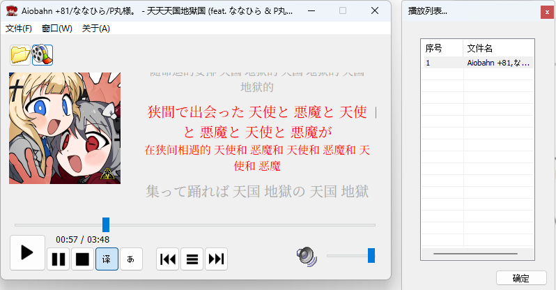

  
<b>MFCMusicPlayer</b>

A Simple music player, written in C++. 
<!--  -->

Features:
- CMake build system support
- decode & play music files with FFmpeg
- real-time playback with XAudio2, swresample -> 44.1kHz/16bit/2ch pcm output
- simple gui
- lyric display support
- word-by-word LRC parser / ESLyric parser, karaoke-like display
- translation / romanization support
- ARM64 build, tested on Snapdragon X Elite
- NCM music format support (algorithm from [音乐解锁](https://git.unlock-music.dev/um/web))
- Windows's SystemMediaTransportControls support
- audio spectrum display based on fftw3
- equalizer support based on libavfilter

Screenshot:

Depends: FFmpeg, XAudio2, OpenSSL, rapidjson, cpp-base64, cppwinrt, fftw3

Supported Platform: Windows 10 version 10240 or later(in theory), Windows 11 latest(tested)

UI: MFC(main), Direct2D/DirectWrite(lyric), GDI+(spectrum)

License: MIT (main-program), LGPL (ffmpeg), MIT (Windows App SDK), [Microsoft DirectX Software Development Kit License](LICENSE.XAudio2.txt) (XAudio2, direct2d), MIT (NCM Decoder)

Contact: lucas150670@petalmail.com

### note:
- no ffmpeg libraries (in either source code form, or binary form) are included in this repository.
- if you want to build this project yourself, you will need to download ffmpeg libraries yourself. please note that ffmpeg is distributed under different licenses, you should comply with the licenses of the libraries you download.
- automatic builds from [Github Actions](https://github.com/lucas150670/MFCMusicPlayer/actions) are available. ffmpeg libraries in build artifact are fetched from vcpkg directly and under LGPL license.
- resources used are under their own licenses. if their usage violated your right, please contact me.
- the project icon was created by [白菜叶_](https://space.bilibili.com/1954890407). this icon is not free for use, and is not distributed under the main program's license.  any utilization, reproduction, modification, or distribution of the icon is strictly prohibited without the explicit written authorization of the original author or lucas150670.
- MSBuild project files are only used to modify UI. Building the project with CMake is recommended, as MSBuild project is not tested and properly configured with 3rd party libraries.

### for mainland china users:
- you can access this project from [GitCode Mirror](https://gitcode.com/lucas150670/MFCMusicPlayer).

### credit (no particular order):
- [白菜叶_](https://space.bilibili.com/1954890407) (logo artist)
- [undefined](https://github.com/steve84966)
- [Zopiclone](https://github.com/Zopiclone-Main)
- Adam
- 任行道
- [Xx_Dark_D_xX](https://github.com/mizu-mio)
- [xuezhaju](https://github.com/xuezhaju)
- [Vladimir15963](https://github.com/Vladimir15963)
- [dachuan_DC](https://x.com/dachuan_DC)
- and anyone else who has contributed to this project / help test the program.

### sponsor the project
- [爱发电](https://afdian.com/a/lucas150670)

### ingredient of the project!

*そっと咲いて征く言葉だけ どうか綺麗で居て欲しいだけ*

*明日笑えるから今だけ 歌い続けるメイド*

*過去にバイバイバイ 今を愛愛愛してる 言えたら痛みにバイバイバイ*

*今日は魔法にかかったメイド ささやかな晴れ舞台*

-- MIMI; 重音テト - マジック・メイド

